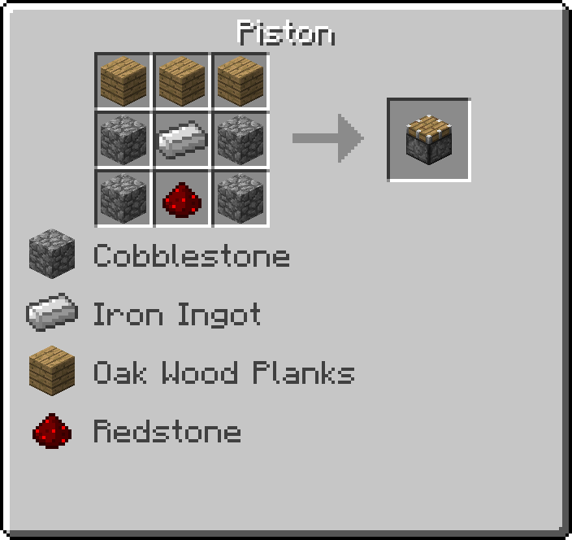
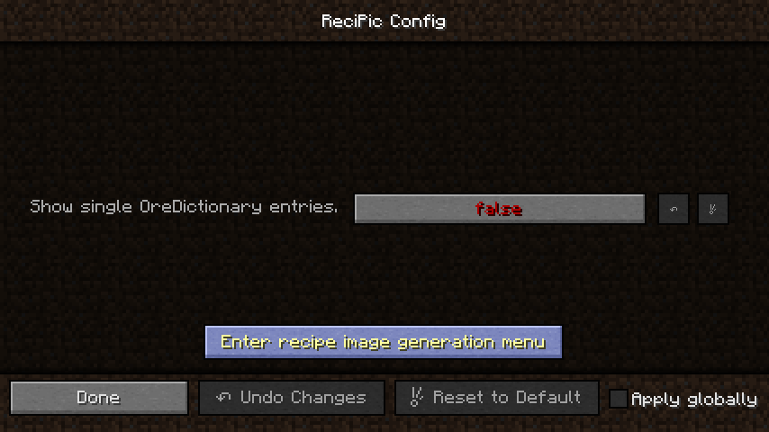
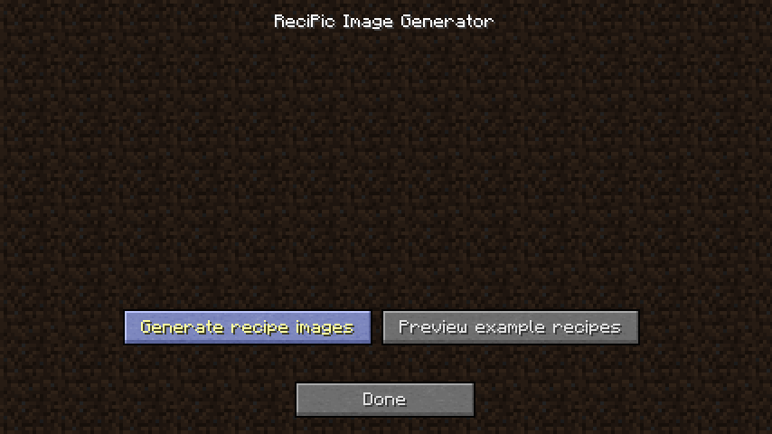
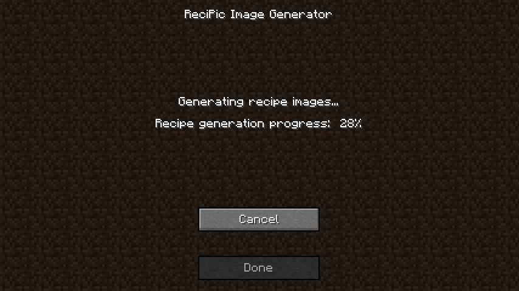

# ReciPic

**This mod is not yet finished! Feel free to try a developer build, or check out the code!**

ReciPic is a "mod" that generates image files displaying crafting recipes.

These images can be used in README files, mod descriptions, wiki pages etc. ReciPic does not add any new content to Minecraft.

## How to use:

ReciPic's main image generation menu can be found in the configuration menu. Select the "Enter recipe generation menu" button to enter it.

From there, select the "Generate recipe images" button to start generating the recipe images.

This may take some time. When finished, the recipe images can be found in a "recipes" subfolder inside your Minecraft installation folder. Note that if anything else happens to be saved to this particular subfolder, ReciPic will delete it. Please make sure that it is not in use for anything else before running this mod.

